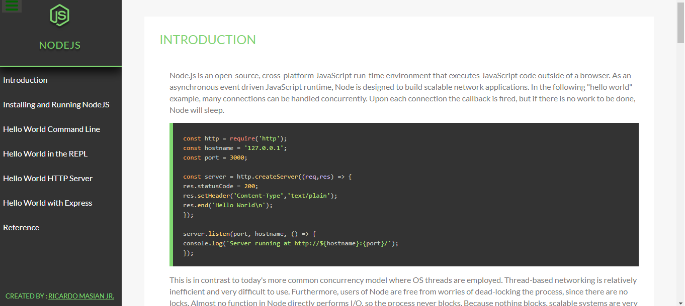

# fcc-technical-documentation-page

Build a Technical Documentation Page. This is the fourth project of [FreeCodeCamp Responsive Web Design Certification](https://learn.freecodecamp.org/responsive-web-design/responsive-web-design-projects/build-a-technical-documentation-page).

A technical documentation page about NodeJS, a javascript run-time environment that executes javascript code outside of a browser.

## Live Demonstration

Live project link: <https://codepen.io/rmasianjr/full/bQvvRg>

## Screenshot

## Objective

- [x] Build a CodePen.io app that is functionally similar to this: <https://codepen.io/freeCodeCamp/full/NdrKKL>. Fulfill the below user stories and get all of the tests to pass. Give it your own personal style. You can use HTML, JavaScript, and CSS to complete this project. Plain CSS is recommended because that is what the lessons have covered so far and you should get some practice with plain CSS. You can use Bootstrap or SASS if you choose. Additional technologies (just for example jQuery, React, Angular, or Vue) are not recommended for this project, and using them is at your own risk. Other projects will give you a chance to work with different technology stacks like React. We will accept and try to fix all issue reports that use the suggested technology stack for this project. Happy coding!

## User Stories

- [x] I can see a `main` element with a corresponding `id="main-doc"`, which contains the page's main content (technical documentation).
- [x] Within the `#main-doc` element, I can see several `section` elements, each with a class of `main-section`. There should be a minimum of 5.
- [x] The first element within each `.main-section` should be a `header` element which contains text that describes the topic of that section.
- [x] Each `section` element with the class of `main-section` should also have an id that corresponds with the text of each `header` contained within it. Any spaces should be replaced with underscores (e.g. The `section` that contains the header "Javascript and Java" should have a corresponding `id="Javascript_and_Java"`).
- [x] The `.main-section` elements should contain at least 10 `p` elements total (not each).
- [x] The `.main-section` elements should contain at least 5 `code` elements total (not each).
- [x] The `.main-section` elements should contain at least 5 `li` items total (not each).
- [x] I can see a `nav` element with a corresponding `id="navbar"`.
- [x] The navbar element should contain one `header` element which contains text that describes the topic of the technical documentation.
- [x] Additionally, the navbar should contain link (`a`) elements with the class of `nav-link`. There should be one for every element with the class `main-section`.
- [x] The `header` element in the navbar must come before any link (`a`) elements in the navbar.
- [x] Each element with the class of `nav-link` should contain text that corresponds to the `header` text within each `section` (e.g. if you have a "Hello world" section/header, your navbar should have an element which contains the text "Hello world").
- [x] When I click on a navbar element, the page should navigate to the corresponding section of the `main-doc` element (e.g. If I click on a `nav-link` element that contains the text "Hello world", the page navigates to a `section` element that has that id and contains the corresponding `header`.
- [x] On regular sized devices (laptops, desktops), the element with `id="navbar"` should be shown on the left side of the screen and should always be visible to the user.
- [x] My Technical Documentation page should use at least one media query.
